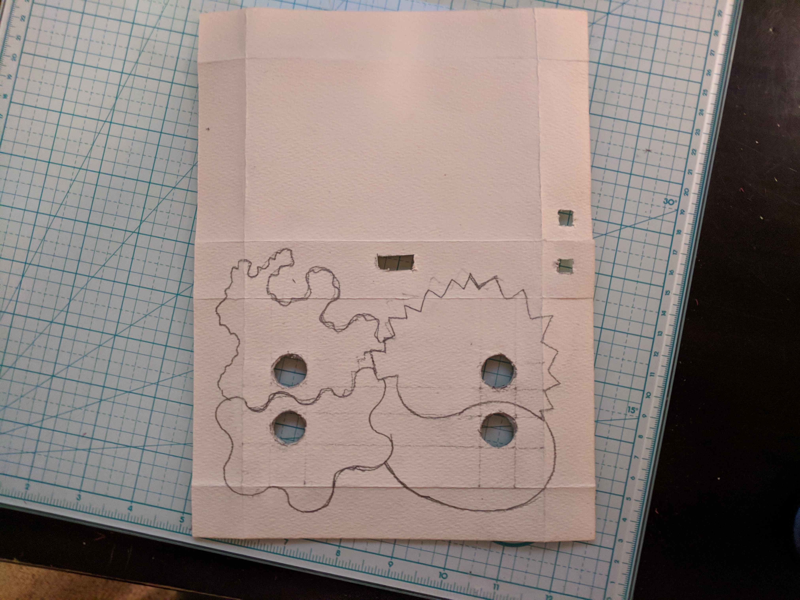

# a3V + 5V + udio-emotion-toy
A simple audio program for Raspberry Pi that will play sounds from different folders depending on the button you press

# parts list 

I purchased all parts from Adafruit. You could also find cheaper vendors for the same. I reccomend Adafruit especially for people in the early stages of learning, due to better documentation, reliability of parts, and fast shipping in the US. Howver you can save a lot of money using other vendors such as Mouserr or Aliexpress.

[Raspberry Pi Zero W](https://www.adafruit.com/product/3400?gclid=CjwKCAiA7ovTBRAQEiwAo8dPcT7r_diZ0nh_mxDEbGtFlZWElk7pgPRVqEoXtqhEhSXQYM8Y6hEbBBoCS2YQAvD_BwE)
[Adafruit I2S 3W Stereo Speaker Bonnet for Raspberry Pi - Mini Kit](https://www.adafruit.com/product/3346)

[16mm Illuminated Pushbutton - Yellow Momentary](https://www.adafruit.com/product/1441) 
[16mm Illuminated Pushbutton - Red Momentary](https://www.adafruit.com/product/1439)
[16mm Illuminated Pushbutton - Green Momentary](https://www.adafruit.com/product/1440)
[16mm Illuminated Pushbutton - Blue Momentary](https://www.adafruit.com/product/1477)
[Double-Side Prototype PCB Board](https://www.amazon.com/Double-Side-Prototype-Universal-Printed-Circuit/dp/B012YZ2Q3W?th=1) - not required but adds convenience

# overview of parts

this guide assumes you already have a raspberry pi zero with raspbian setup and male headers attached - the speaker bonnet uses female headers 

[learning guide - Adafruit Speaker Bonnet for Raspberry Pi](https://learn.adafruit.com/adafruit-speaker-bonnet-for-raspberry-pi/pinouts)
 - note that pins 18, 19, and 21 of the pi are used by the sound bonnet, you cannot use them for any other purpose
 - 3V and 5V and GND at the 'top' of the GPIO are also used by the bonnet

# watercolour paper enclosure

Box is made using origami video: https://www.youtube.com/watch?time_continue=6&v=R6TUvYCrdvM

